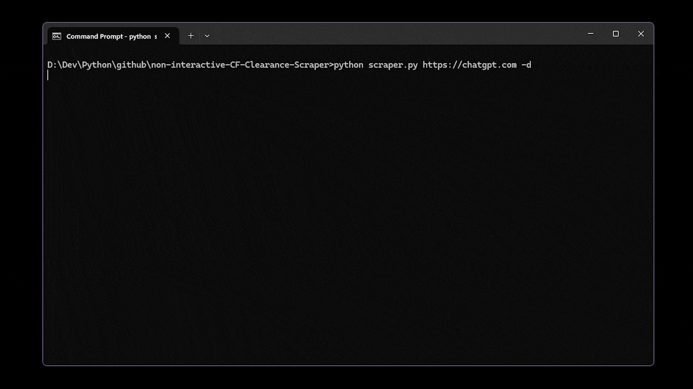

# Non Interactive CF Clearance Scraper

This project uses Playwright to emulate a browser and bypass Cloudflare's non-interactive challenge to retrieve the `cf_clearance` cookie from a protected website.


## Features

- Uses Playwright to simulate a browser.
- Bypasses Cloudflare's non-interactive challenge to retrieve the `cf_clearance` cookie.
- Supports the use of proxies and custom user agents.
- Allows configuring a timeout before giving up on retrieving the cookie.

## Docker

Soon...

## Installation

```bash
pip install -r requirements.txt
python -m playwright install chromium
```

## Usage

Run the script from the command line to retrieve the `cf_clearance` cookie for a given URL:

```bash
python cf_clearance_scraper.py <URL> [-ua USER_AGENT] [-t TIMEOUT] [-p PROXY] [-d]
```

### Arguments:

- `URL`: The URL where the non-interactive Cloudflare challenge is located.
- `-ua USER_AGENT`: The user agent to be used by the browser. If not specified, a random user agent will be used.
- `-t TIMEOUT`: The maximum number of seconds to wait for the cookie to be retrieved. Default is 20 seconds.
- `-p PROXY`: Proxy to be used for retrieving the cf_clearance cookie.
- `-d`: Enable debug logging for additional details during the process.

## Example

```bash
python cf_clearance_scraper.py https://chatgpt.com -ua "Mozilla/5.0" -t 30 -p "user:password@proxyserver:8080" -d
```

This command will attempt to retrieve the `cf_clearance` cookie from `https://chatgpt.com` using the provided user agent, proxy, and a 30-second timeout.

## License

This project is licensed under the MIT License - see the [LICENSE](LICENSE) file for details.

## Disclaimer of Liability

By using this project, you agree that you are solely responsible for how you use it. This tool is intended for educational purposes and personal use only. The author does not encourage or endorse any unauthorized or unethical use of this tool.

This project is not affiliated with Cloudflare in any way, and any use of this tool to bypass security measures may violate Cloudflare's terms of service or the terms of service of other websites. The author is not liable for any damage or consequences that may arise from using this tool. Use it at your own risk.